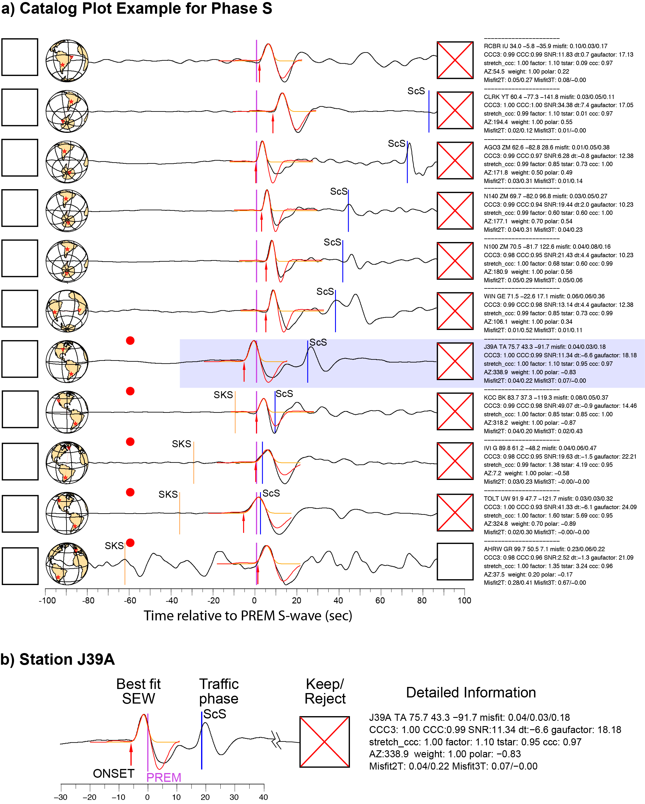

EWPredict
==============================

The goal of this project is to utilize machine learning algorithms to catagorize seismic records based on information produced by [Empirical Wavelet Method](https://github.com/Leviyu/EQTime). 

Being able to automatically predict the quality (accept or reject) of seismic record combined with Empriical Wavelet Making mathod would allows us to build seismic dataset in a fast, systematical and consistant manner. And being able to do so, would allow us to establish first step towards a new era for seismology. 

## Project Objective

We have gathered 50 processed earthquake event data from [Empirical Wavelet Method](https://github.com/Leviyu/EQTime). For each event, there are thousands of seismic stations recordings that is documented. Each seismic records is associated with comprehensive measurements that is related to its signal-to-noise ratio, waveform distortation, amplitude attenuation et al., as show below in Figure. 

Fig.jpg 

### Data Detail
The boxes on the right side is the algorithm that we implemented based on very simple rules to distinguish the signal from the background noise (in this example, the cross in the box means it is accepted and has high quality, otherwise it is rejected). Unfortunately, seismic data are intrinsicly complex and our simple algorithm does not perform at the level that we wanted. So the project is our efforts to train machine learning model to accurately classify our sesimic records into 'accept' and 'reject' catagory. 

To train the model, we have manually classified seismic data from about 50 earthquakes, which is about 170k data entries. And we use this data to train supervised learning model and test the performance.

## Models

The data exploration and visualization can be found in the notebook under `./notebooks`

Project Organization
------------

    ├── LICENSE
    ├── README.md          <- The top-level README for developers using this project.
    ├── data
    │   ├── external       <- Data from third party sources.
    │   ├── interim        <- Intermediate data that has been transformed.
    │   ├── processed      <- The final, canonical data sets for modeling.
    │   └── raw            <- The original, immutable data dump.
    │
    ├── docs               <- A default Sphinx project; see sphinx-doc.org for details
    │
    ├── models             <- Trained and serialized models, model predictions, or model summaries
    │
    ├── notebooks          <- Jupyter notebooks. Naming convention is a number (for ordering),
    │                         the creator's initials, and a short `-` delimited description, e.g.
    │                         `1.0-jqp-initial-data-exploration`.
    │
    ├── references         <- Data dictionaries, manuals, and all other explanatory materials.
    │
    ├── reports            <- Generated analysis as HTML, PDF, LaTeX, etc.
    │   └── figures        <- Generated graphics and figures to be used in reporting
    │
    ├── requirements.txt   <- The requirements file for reproducing the analysis environment, e.g.
    │                         generated with `pip freeze > requirements.txt`
    │
    ├── setup.py           <- makes project pip installable (pip install -e .) so src can be imported
    ├── src                <- Source code for use in this project.
    │   ├── __init__.py    <- Makes src a Python module
    │   │
    │   ├── data           <- Scripts to download or generate data
    │   │   └── make_dataset.py
    │   │
    │   ├── features       <- Scripts to turn raw data into features for modeling
    │   │   └── build_features.py
    │   │
    │   ├── models         <- Scripts to train models and then use trained models to make
    │   │   │                 predictions
    │   │   ├── predict_model.py
    │   │   └── train_model.py
    │   │
    │   └── visualization  <- Scripts to create exploratory and results oriented visualizations
    │       └── visualize.py
    │
    └── tox.ini            <- tox file with settings for running tox; see tox.testrun.org

--------

<small>Project based on the <a target="_blank" href="https://drivendata.github.io/cookiecutter-data-science/">cookiecutter data science project template</a>. #cookiecutterdatascience</small>

